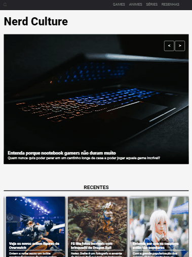
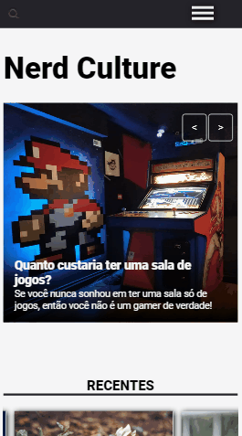

# NerdCultue
Uma página web feita para o aprendizado de responsividade no CSS3

## A página possuia um header básico, um slider de imagens, uma grade de notícias com CSS GRID, e um footer simples

### IPad

### Moto G4

